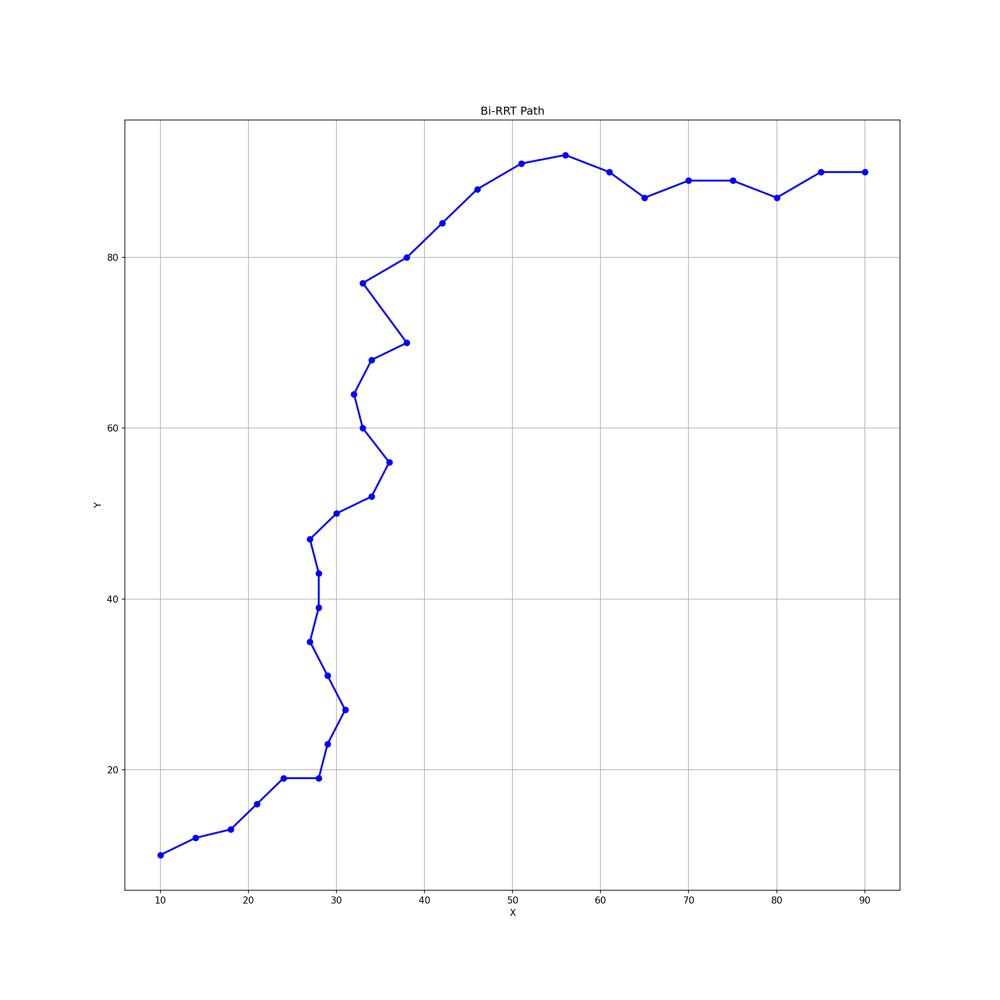
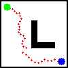

# Bi-RRT-path-planner

A modular Python implementation of the Bidirectional Rapidly-exploring Random Tree (Bi-RRT) algorithm for efficient path planning in 2D grid maps. This project visualizes the search process and final path between a start and goal location using a custom map.

## Features

- Bidirectional RRT for faster convergence
- Custom map loading from `.pgm` files
- Collision checking and tree expansion
- Interactive visualization of search trees and final path
- Modular codebase for easy experimentation

## Project Structure
<pre>
bi-rrt-path-planner/
├── main.py              # Entry point for the planner
├── map_loader.py        # Loads and parses the map
├── planner.py           # Core Bi-RRT logic
├── rrt_utils.py         # Helper functions for RRT
├── visualizer.py        # Visualization of the planning process
├── custom_map.pgm       # Sample map file
├── README.md            # Project documentation
  
</pre>

## How to Run

Make sure you're in the project directory, then run:

python main.py

## Demo Outputs

### Original Map

### Path Plot Only

### Path Overlaid on Map

